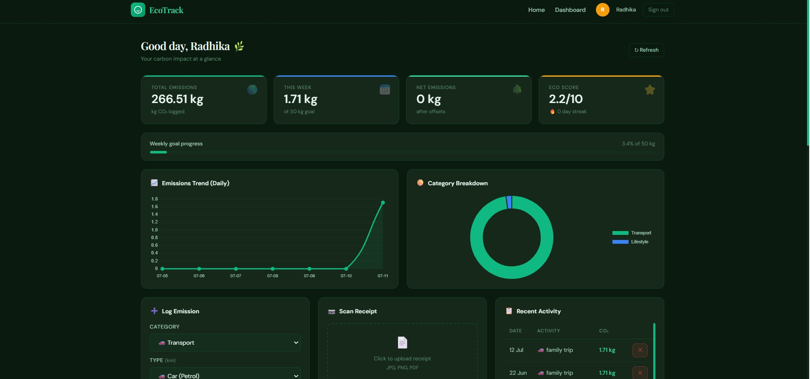
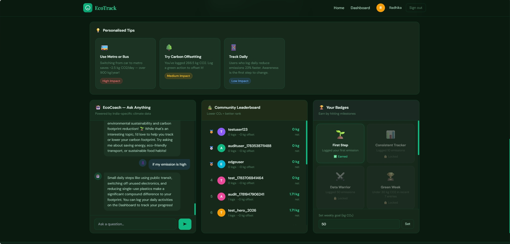

# 🌿 EcoTrack – AI Powered Carbon Footprint Tracker

> A full-stack AI-powered web application that helps users monitor, reduce, and understand their carbon footprint through intelligent insights, receipt scanning, and personalized sustainability recommendations.


---

# 📌 Overview

EcoTrack enables users to:

- 🌍 Track their carbon emissions
- 🤖 Chat with an AI sustainability assistant
- 🧾 Scan shopping receipts using AI
- 📊 Visualize environmental impact
- 🎯 Set sustainability goals
- 🏅 Earn eco-achievements
- 🏆 Compete on a community leaderboard

The project combines modern web technologies with Generative AI to make sustainable living more interactive and data-driven.

---

# 🚀 Features

## 🔐 Secure Authentication

- User Registration
- Login / Logout
- Session Authentication
- Password Hashing (bcrypt)
- Session Regeneration
- Secure Route Protection

---

## 📊 Dashboard

- Carbon emission overview
- Weekly statistics
- Monthly analytics
- Progress cards
- Interactive charts

---

## 🤖 AI Eco Assistant

Powered using **Google Gemini API** with fallback support.

The chatbot can:

- Answer sustainability questions
- Give personalized eco tips
- Explain carbon emissions
- Suggest greener alternatives
- Recommend lifestyle improvements

---

## 🧾 AI Receipt Scanner

Upload shopping receipts and let AI automatically:

- Detect purchased items
- Estimate carbon footprint
- Categorize products
- Suggest eco-friendly alternatives

---

## 🎯 Goal Tracking

Create sustainability goals like

- Reduce emissions
- Save electricity
- Reduce plastic usage
- Use public transport

Track progress over time.

---

## 🏅 Achievement System

Unlock badges for eco-friendly habits.

Examples:

- Green Starter
- Eco Warrior
- Carbon Saver
- Sustainability Champion

---

## 🏆 Leaderboard

Compare your sustainability score with other users.

---

## 📈 Analytics

- Emission history
- Category-wise breakdown
- Progress visualization
- Performance trends

---

# 🛠 Tech Stack

## Frontend

- HTML5
- CSS3
- JavaScript
- Chart.js

## Backend

- Node.js
- Express.js

## Database

- MongoDB
- Mongoose

## AI

- Google Gemini API
- Groq API (Fallback)

## Authentication

- Express Session
- bcrypt

---

# 📂 Project Structure

```
EcoTrack
│
├── public/
│   ├── static/
│   ├── templates/
│
├── screenshots/
│
├── src/
│   ├── config/
│   ├── controllers/
│   ├── middleware/
│   ├── models/
│   ├── routes/
│   ├── services/
│   ├── utils/
│   └── server.js
│
├── uploads/
├── package.json
└── README.md
```

---

# 📸 Screenshots

## 🏠 Home


---

## 🔐 Login


---

## 📊 Dashboard



---

## 🤖 AI Chatbot



---

# ⚙️ Installation

Clone the repository

```bash
git clone https://github.com/rastogiradhika/EcoTrack-Carbon-Footprint-Tracker.git
```

Move into project

```bash
cd EcoTrack-Carbon-Footprint-Tracker
```

Install dependencies

```bash
npm install
```

Create a `.env`

```env
PORT=5000

MONGODB_URI=your_mongodb_connection

SESSION_SECRET=your_session_secret

GEMINI_API_KEY=your_gemini_api_key

GROQ_API_KEY=your_groq_api_key
```

Run

```bash
npm run dev
```

Open

```
http://localhost:5000
```

---

# 🔒 Security Features

- Password hashing
- Session regeneration
- Protected routes
- Helmet security
- Rate limiting
- Secure cookies
- Input validation

---

# 🌱 Future Improvements

- OAuth Login
- Carbon Prediction using ML
- Mobile Application
- Email Notifications
- Carbon Offset Marketplace
- PDF Report Generation
- AI Meal Recommendation
- Smart Sustainability Challenges

---

# 💡 Motivation

Climate change affects everyone.

EcoTrack was built to make sustainability measurable, understandable, and engaging using AI and data visualization.

---

# 👩‍💻 Developer

**Radhika**

Computer Science Undergraduate

- 🌐 GitHub: https://github.com/rastogiradhika

---

# ⭐ Support

If you found this project useful, consider giving it a ⭐ on GitHub!
